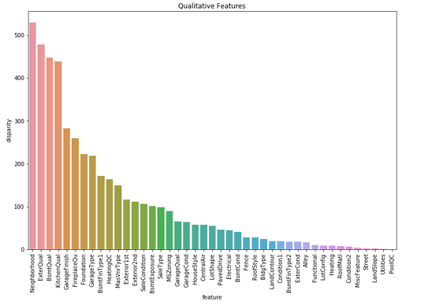

# AMES IA Housing Data - EDA and Modeling

## Overview and Current Status
- EDA, feature selection, and modeling of the AMES IA housing dataset
- Model parameters can be further optimized
- More work can be done including location-based features

### Workflow
1. EDA - loads the Housing data, cleans and investigates the data, and selects features for Modeling
2. Modeling - instantiates and runs and Linear Model and a DNNRegressor using the Tensorflows API

### Problem Statement
- What are the key drivers of housing prices?
- Can we build a generalized model that is able to make sense of qualitative and quantitave features?

## DATA

### Ames IA Housing Dataset
- Data located here: https://www.kaggle.com/c/house-prices-advanced-regression-techniques/data
- Data Documentation located here: (http://jse.amstat.org/v19n3/decock/DataDocumentation.txt)

## EDA and Feature Selection

- Potential features were identified by filling missing values, investigating distributions, and checking relationships between each feature and the target variable - SalePrice.
- Categorical Variables were grouped by sale price, and encoded as numeric, to allow for more flexibility in modeling
- Features were selected based on their relative strength in prediciting the target variable, and for their intuitive interpretatiblity, striking a balance between overfitting the model and model performance

## Modeling

- Two Models were fit on the training data

    -A Linear Regression
        - Results:
        
       
    

    -A DNNRegressor using the Tensorflows Esitmator API
        - Results:

    
    
    

### Conclusions

Both Models were able to predict housing prices, based on a subset of features. The models identified intuitive features like Size of House, Overall Quality of house, Quality of Foundation, Kitcehn Quality Garage size, type, and quality, and Neighborhood. This gives a good indication that these features are key drivers of housing value. It also suggests that homeowners looking to improve value of house can focus on improving kitchen, basement, and garage quality.

### Further Study

- How can neighborhood variable be futher explored, beyond encoding based on price
- Creating custom model from Tensorflows to make more specific input and activation functions